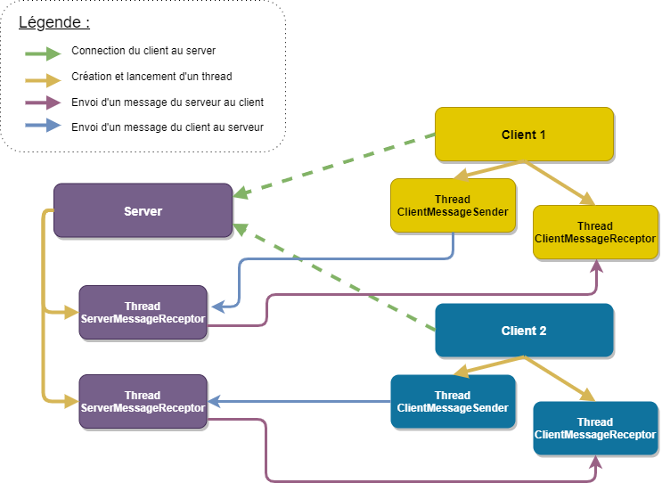
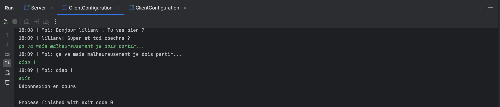
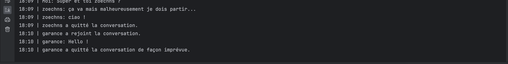
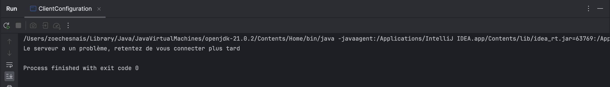

# Rapport Devoir 1

## Contexte

Dans le cadre de l'UV SR03 (Architecture des applications Internet),
une application de chat sera développée tout le long du semestre. L'objectif est de mettre en
application les concepts étudiés en cours et utilisés en TD sur un projet plus concrêt.
Le projet se décompose en trois devoirs :

- Communication réseau
- Sécurité
- Implémentation d’une application web FullStack

### Le projet

Le devoir 1 correspondant à la partie "communication réseau" du projet, a pour objectif de développer une
application de chat Client/Serveur via les sockets qui permet d’organiser une
discussion publique entre un ensemble de participants.

### Concepts utilisés

- Afin d'effectuer un communication client/Serveur, les sockets sont utilisés.
- La programmation objet, au coeur de cette application sera le paradigme utilisé
    - Il sera possible de retrouver l'utilisation de l'héritage et la surcharge de certaines méthodes
    - Chaque classe joue sont rôle (Client, Server, threads de communication) joue sont rôle et communique avec les
      autres classes
    - JAVA sera le langage orienté objet utilisé pour cette application notamment car il possède un ensemble de classes
      permettant l'utilisation et la gestion des sockets
- Le multi-threading sera utilisé. Il permet de lancer un ensemble de threads, processus fils executables simultanément
  au sein d'un programme unique. C'est grâce à ce concept que plusieurs clients pourront se connecter et communiquer
  ensemble.

### Objectifs fixés

L'objectif de cette application est de permettre à plusieurs clients de se connecter à un serveur unique et de
communiquer entre
eux comme au sein d'un groupe de discussion. Il devra être possible de choisir un pseudo qui apparaitra lorsque le
client communique
et les clients seront notifiés lors de l'arrivée ou le départ d'un client.

### Cas d'utilisation

## Conception et Développement

### Architecture de l'application

**L’application est composée de deux classes principales :**

1. La classe `Server` permet aux clients de s'y connecter pour pouvoir accéder au fil de discussion.

    - La classe `Server` possède plusieurs attributs :
        - Un ServerSocket qui permet aux clients de se connecter au serveur
        - Un Socket qui correspond au socket du client qui se connecte au serveur
        - Un entier qui sert de compteur pour le nombre de clients connectés
        - Un dictionnaire qui regroupe les pseudos des clients actuellement connectés ainsi que leur canal de sortie qui
          sert à leur envoyer des informations

    - La classe `Server` possède plusieurs méthodes :
        - isExisting permet de savoir si un pseudo existe parmi les pseudos actuellement utilisés ou non. Elle retourne
          donc un booléen et prend un pseudo en argument
        - addToConnectedClients permet d’ajouter un client au dictionnaire
        - removeFromConnectedClients permet de supprimer un client du dictionnaire
        - sendMessagesToClients permet d’envoyer des messages à tous les clients connectés et notamment les messages de
          connection et de déconnection

2. La classe `Client` permet de se connecter au `Server`, d'envoyer ainsi que de recevoir les messages des autres
   clients connectés.
    - La classe `Client` possède plusieurs attributs :
        - Un Socket qui permet la communication avec le serveur.
        - Un attribut booléen qui indique si la connection au serveur est active ou non.
    - La classe `Client` ne possède pas de méthodes particulières si ce n'est le `main`.

**Les deux classes présentées ci-dessus utilisent des Threads afin d'effectuer des executions en parallèle.**
Les threads ont été redéfinis dans des classes qui sont spécifiques à leur utilisation. Chacune de ces classes hérite de
la classe mère thread et possède une surcharge de la methode run() qui est appelée lors du lancement du thread.

Pour chaque connection client/serveur, trois threads sont mis en place :

- Un premier thread est généré côté serveur afin de réceptionner les messages envoyé par un client qui lui est attribué.
  Il y a donc un thread de reception par client.
  Le thread est défini dans la classe `ServerMessageReceptor`.
- Un deuxième permet l'envoi de messages (lus sur le terminal) au serveur.
  Le thread est défini dans la classe `ClientMessageSender`.
- Un troisième permet la reception des messages du serveur au client. Ces messages comprennent ceux envoyés par les
  autres clients.
  Le thread est défini dans la classe `ClientMessageReceptor`.

### Méthodes principales

Nous avons choisi de ne pas développer l'explication de l'ensemble de nos méthodes mais de simplement expliquer brièvement leur utilité au sein de leur classe.
Pour plus d'informations quand aux spécificités d'une fonction, veuillez regarder la JAVADOC et les commentaires dans le corps de la fonction.
#### Méthodes de `Server`

>`boolean isExisting(String pseudo)`
> 
> Cette fonction nous permet de savoir si un pseudo est déjà présent dans la table de hachage `connectedClients` contenant tous les pseudos connectés à l'application, et ainsi garantir l'unicité du pseudo.

>`void addToConnectedClients(String pseudo, DataOutputStream outputClient)`
> &
>`void removeFromConnectedClients(String pseudo)`
> 
> Nous avons choisi de surcharger les fonctions de manipulation de la table de hachage `connectedClients`, afin d'intégrer des données métier à notre application, telles que le nombre de pseudonymes présents dans la table, indiquant ainsi le nombre de clients connectés.

>`void sendMessageToClients(String message, String pseudo)`
>
> Notre décision a été de mettre en place une fonction commune pour tous les types de messages envoyés à l'ensemble des clients. 
> Par conséquent, qu'il s'agisse d'un message devant être retransmis ou simplement informatif (comme une notification de nouvelle connexion ou de déconnexion), il sera transmis grâce à cette méthode.

### Gestion de l'arrêt des programmes

#### Utilisation d'une variable pour connaître l'état de la connection

Dans les classes principales, une variable booléenne `activeConnection` a été ajoutée afin de connaitre l'état de la connexion
entre le serveur et le client. Si la variable est à false la connection n'est plus active, sinon la connection
est active et la variable est à true. Utiliser une variable comme ceci permet aux threads de sortir de se terminer sans
qu'il y ait d'erreur. En effet, le programme principal attend que les threads se terminent avant de supprimer le socket
de connexion pour éviter les erreurs.

#### Traitement des exceptions

Dans certains cas, une variable d'état de connection ne suffit pas. En effet, lorsque le programme est en attente d'une
entrée sur le terminal par exemple, il n'y a pas de vérification de la variable et une exception est renvoyée aprés la
lecture.
Nous avons donc étudié les possibilités d'exceptions et traités les différents cas afin que les programmes se comportent
de la meilleure façon possible :

- Dans le cas d'une fermeture de connection (passage de la variable d'état à false)
- Lors de la fermeture imprévue d'un client
- Lors de la fermeture imprévue du serveur
  Le programme peut donc soit s'arrêter aprés la récupération de l'exception, en envoyant les informations nécessaires,
  soit reprendre son fonctionnement normal (cas du serveur)

#### Fermeture avec `System.exit(0)`

Pour le cas particulier de la fermeture imprévue du serveur, le client peut être bloqué dans l'attente d'un message avec
le scanner permettant de lire le terminal.
Ce cas particulier concerne spécifiquement le `ClientMessageSender` qui lit le message. Afin d'éviter que le client soit
obligé d'écrire un message pour se faire
déconnecter, une boucle de vérification de l'état du thread et une fermeture du programme ont été mises en place. Ainsi
si le thread ne se finit pas alors qu'il le devrait, on le ferme avec le programme.

### Langues utilisées

Nous avons choisi d'employer l'anglais pour définir nos méthodes, nos classes, ainsi que les messages destinés au serveur. 
Cette décision s'appuie sur le fait que l'anglais est la langue dominante dans le domaine de la programmation et de l'informatique, ce qui facilite la compréhension et la collaboration pour un large panel de développeurs. 
De plus, cela rendrait notre projet plus accessible à une communauté internationale en cas de réutilisation. 
Néanmoins, étant donné que notre application cible principalement les utilisateurs francophones pour le moment, nous avons décidé d'utiliser le français pour les messages destinés au `Client` et pour l'interface générale du `Client`.

### Unicité des pseudos

Afin de garantir qu'un pseudo est unique, une méthode `boolean isExisting(String pseudo)` au sein du serveur permet
d'effectuer une vérification.
Elle parcourt le dictionnaire `connectedClients` et vérifie que le pseudo entré n'est pas déjà présent.
De cette façon si un pseudo est déjà utilisé, le serveur pourra notifier le client pour qu'il en choisisse un autre,
jusqu'à ce qu'il choisisse un pseudo unique

## Scénarios d'utilisation

### Récupérer et lancer l'application

#### Récupérer l'application

Pour visualiser le projet sur Github, rendez-vous sur le lien suivant :
> https://github.com/lilianvltgr/SR03-Devoir1

Pour ensuite cloner le projet, rendez-vous sur Code > Local > Clone

Choisissez le lien HTTPS (donné également ci-dessous).

> https://github.com/lilianvltgr/SR03-Devoir1.git

Sur votre IDE :
Choisissez de créer un projet avec VCS et collez le lien donné ci-dessus.

A présent, suivez les instructions de votre IDE et le projet devrait se cloner correctement.

#### Lancer l'application

Pour lancer l'application, il est nécessaire de créer une Configuration (généralement en haut à droite dans votre IDE).

Créez une configuration `ClientConfiguration` qui utilise le fichier `Client` (fr.utc.sr03.clientPackage.Client sur
l'image ci-dessus)
et authorisez les instances multiples dans les options.
À présent, créez de la même façon une configuration `ServerConfiguration` qui utilise le fichier `Server` (
fr.utc.sr03.clientPackage.Server) et lancez la.
Le serveur est ainsi lancé.
Maintenant, cliquez sur la configuration `ClientConfiguration` et lancez là autant de fois que vous voulez de clients. 
Par exemple si vous voulez 4 clients, il est nécessaire de lancer 4 fois la configuration `ClientConfiguration`.

À ce stade, vous pouvez normalement utiliser l'application en suivant les instructions sur la console
de `ClientConfiguration`.

### Cas d'utilisations pratiques

#### Démarrer le chat

Afin de démarrer le chat, il faut ainsi lancer la classe `Server` puis lancer la configuration créée normalement précédemment `ClientConfiguration`.
Il sera demandé sur le terminal du client d'entrer un pseudo. Ensuite, celui-ci sera connecté au fil de discussion.

#### Ajouter des utilisateurs

Pour ajouter un utilisateur il suffit de relancer la configuration `ClientConfiguration`. 
Celui-ci sera connecté après avoir choisi un pseudo.

#### Démarrer la discussion

Aprés la connection, le client peut écrire un message sur le terminal qui sera envoyé à tous les utilisateurs.
De même, il recevra les messages écrit par les autres clients.

#### Quitter le chat

Pour quitter le chat, il suffit que le client tape "exit". La déconnexion s'effectuera et les autres clients seront
notifiés.

### Cas particuliers

#### Client interrompu

Si le client a un problème, les autres utilisateurs seront notifiés et le serveur supprimera le client de sa base de
données.

#### Connexion échouée

Si un client, tente de se connecter avant que le server ne tourne, un message informant
que le serveur a un problème sera renvoyé au client et son programme se terminera.

#### Serveur interrompu

Si le serveur est interrompu, les clients sont notifiés et sont déconnectés.

## Futures Améliorations

### Traitement des exceptions

Les exceptions connues et anticipées, telles que la fermeture de certains sockets lors d'une déconnexion, sont gérées de manière à prévenir un arrêt total du programme. 
De plus, les clients et le serveur sont notifiés lorsque cela est nécessaire. 
Nous avons traité au mieux les exceptions en fonction de nos connaissances actuelles, en utilisant les exceptions déjà disponibles en Java. 
Cependant, pour la suite de notre application, il sera sans doute préférable de créer nos propres exceptions pour une gestion plus spécifique et précise.

